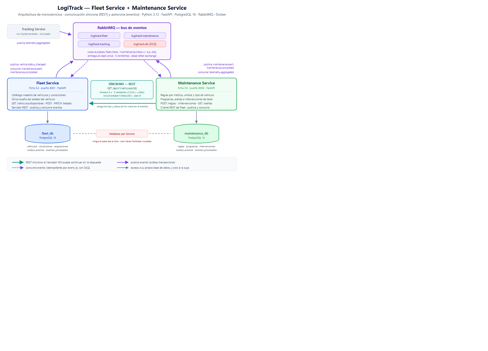

# LogiTrack — Fleet Service + Maintenance Service

Implementación funcional de 2 de los 10 microservicios del documento de arquitectura
(fichas 3.2 y 3.6). Python 3.12 · FastAPI · SQLAlchemy 2 · PostgreSQL 16 · RabbitMQ · Docker.

## Arquitectura



> Fuente vectorial editable: [`docs/arquitectura.svg`](docs/arquitectura.svg)

Los dos servicios **nunca comparten base de datos** y se comunican de dos formas
distintas, cada una donde corresponde: por **eventos** cuando el emisor puede
seguir trabajando sin esperar, y por **REST síncrono** en el único punto donde el
llamador no puede continuar sin la respuesta. El detalle está más abajo.

## Por qué estos dos

| Criterio | Fleet (3.2) | Maintenance (3.6) |
|---|---|---|
| Dependencias externas | ninguna | ninguna |
| Base de datos | PostgreSQL 16 | PostgreSQL 16 |
| Rol en el bus | publica y consume | publica y consume |
| Rol en REST síncrono | servidor | cliente de Fleet |
| Lógica | CRUD + máquina de estados | reglas de umbral |

Los demás exigen Mapbox (Routing), TimescaleDB (Tracking), pasarelas SMS (Notification),
APIs aduaneras (Customs), ETL y esquema en estrella (Analytics) o son el núcleo
transaccional con saga (Shipment). Estos dos, además, se hablan entre sí, así que
el par demuestra REST síncrono + eventos + outbox + idempotencia + DLQ sin montar los diez.

## Requisito: los dos repos, clonados uno al lado del otro

El `docker-compose.yml` construye servicios de este repo **y** de
`kevin-logitrack` (routing, shipment, tracking), cuya ruta se resuelve con
`${RUTA_KEVIN:-../kevin-logitrack}`. Un clon aislado de este repo no arranca:
Docker falla con `build path ... does not exist` sin explicar por qué. El árbol
de carpetas debe ser este:

```text
logitrack-completo/
├── logitrack/         <- este repo (fleet, maintenance, frontend)
└── kevin-logitrack/   <- routing, shipment, tracking
```

Si la carpeta del otro repo se llama distinto no hay que editar nada: antes de
levantar el stack, apunta `RUTA_KEVIN` a ella (PowerShell):

```powershell
$env:RUTA_KEVIN = '../como-se-llame'
```

## Arrancar todo

```bash
docker compose up --build -d
docker compose ps            # esperar a que los 5 servicios estén healthy

python -m pip install requests pika
python scripts/seed.py       # datos iniciales
python scripts/demo_e2e.py   # prueba end-to-end de los 9 pasos
```

- Fleet: http://localhost:8001/docs
- Maintenance: http://localhost:8006/docs
- RabbitMQ: http://localhost:15672 (logitrack / logitrack)

## Frontend

Dashboard en React + Vite que consume los dos microservicios. Vive en `frontend/` y es
independiente: no se mezcla con el código de los servicios.

```bash
docker compose up -d          # los backends primero

cd frontend
cp .env.example .env
npm install                   # solo la primera vez
npm run dev                   # http://localhost:5173
```

Cuatro pestañas que cubren **todos** los endpoints de los dos servicios:

| Pestaña | Qué muestra | Endpoints que consume |
|---|---|---|
| **Flota** | Catálogo con filtros y paginación, alta de vehículos, cambio de estado (que encola `vehicle.status_changed` en el outbox) y ficha combinada | `GET /vehiculos`, `/disponibles`, `/{id}`, `POST /vehiculos`, `PATCH /{id}/estado`, `GET /mantenimiento/vehiculo/{id}/ficha` |
| **Conductores** | Catálogo con búsqueda, alta con categorías de licencia y consulta de disponibilidad | `GET /conductores`, `POST /conductores`, `GET /conductores/{id}/disponibilidad` |
| **Mantenimiento** | Alertas abiertas y cerradas, calendario de preventivos, catálogo de reglas, alta de reglas y registro de intervenciones | `GET /alertas`, `/proximos`, `/reglas`, `POST /reglas`, `POST /intervenciones` |
| **Comunicación síncrona** | Estado del circuit breaker en vivo con cuenta atrás, la política de resiliencia y un botón que provoca los 5 fallos que lo abren | `GET /mantenimiento/dependencias`, `/vehiculo/{id}/ficha` |

Esa última pestaña es la demostración del patrón: con el circuito abierto, la consulta
responde en ~0 ms en lugar de ~3.300 ms, porque ni siquiera intenta la conexión.

**Cambios que el panel exigió en el backend**

1. **CORS.** Un navegador bloquea las
peticiones entre orígenes distintos (`:5173` → `:8001`) salvo que el servidor lo autorice
explícitamente. Son cuatro líneas en cada `main.py` y la lista de orígenes permitidos está en
`config.py` (`cors_origins`), configurable por variable de entorno.

2. **Dos listados nuevos en Fleet** — `GET /api/v1/vehiculos` y `GET /api/v1/conductores`.
   No están en la ficha 3.2 del documento y son una desviación consciente: `/disponibles`
   filtra por definición `estado == disponible`, así que sin un listado general el panel no
   podría ver — ni devolver a servicio — justo los vehículos que una alerta acaba de mandar a
   `mantenimiento`. Lo mismo con los conductores: sin listado no se puede consultar la
   disponibilidad de nadie sin conocer su UUID de memoria. Cubiertos por
   `fleet-service/tests/test_catalogo.py`.

Ningún modelo, evento ni prueba existente cambió.

El dashboard llama a los dos servicios directamente. En el diseño completo habría un API
Gateway al frente y el frontend conocería una sola dirección; con dos servicios en local se
llaman directo para no montar un componente que está fuera del alcance de esta entrega.

## Colección de Postman

[`docs/LogiTrack.postman_collection.json`](docs/LogiTrack.postman_collection.json) — 19 peticiones
en 3 carpetas, listas para importar (`Import` → arrastrar el archivo).

Las variables `vehiculo_id`, `conductor_id`, `regla_id` y `programa_id` se llenan solas al lanzar
las peticiones en orden, así que el recorrido se encadena sin copiar y pegar UUIDs. Cada petición
lleva en su descripción qué demuestra y qué códigos de error puede devolver.

Dos peticiones concentran lo que hay que enseñar:

- **`FICHA COMBINADA`** — un solo endpoint devolviendo datos de las dos bases a la vez, con la
  llamada REST síncrona a Fleet en el medio.
- **`Estado del circuit breaker`** — trae instrucciones para abrir el circuito en vivo apagando
  Fleet con `docker compose stop fleet-service`.

El flujo completo que cruza los dos servicios arranca con un evento AMQP, que Postman no puede
publicar: para eso está `python scripts/demo_e2e.py`, que recorre los 13 pasos.

## Los dos estilos de comunicación

El documento (sección 05) fija la regla: *"si el que llama no puede continuar sin
la respuesta, se usa REST síncrono; si puede continuar, se publica un evento"*.
Los dos servicios implementan los dos estilos.

### ASÍNCRONO — eventos por RabbitMQ

```
Maintenance --maintenance.alert-->     Fleet     (saca el vehículo de servicio)
Maintenance --maintenance.completed--> Fleet     (lo devuelve a disponible)
Fleet       --vehicle.status_changed-> (Routing) (recalcula rutas)
Tracking    --telemetry.aggregated-->  Maintenance
```

Con outbox, idempotencia por `event_id`, reintentos y DLQ. Ninguno de los dos
espera al otro: si el destinatario está caído, el mensaje queda en la cola.

### SÍNCRONO — REST de Maintenance hacia Fleet

```
Maintenance --GET /api/v1/vehiculos/{id}--> Fleet
            <--- 200 placa, tipo ---
```

**Por qué es necesario, y no decorativo:** la ficha 3.6 dice que Maintenance
compara la telemetría *"contra reglas por tipo de vehículo"*. El evento
`telemetry.aggregated` no garantiza traer el tipo, y Maintenance no tiene tabla
de vehículos (Database per Service). El tipo y la placa son propiedad de
Fleet: **hay que preguntárselos, y sin esa respuesta no se puede decidir qué
reglas aplicar**. Es exactamente el criterio de la sección 05. El kilometraje
**no** se le pide a Fleet: no lo almacena (`VehiculoOut` no trae `km_actual`)
y el km de las alertas sale del `odometro_km` del evento, que es quien mide el
odómetro.

Implementado en `maintenance-service/app/clients/fleet.py`, con los valores
literales del documento:

| Mecanismo | Valor | Dónde |
|---|---|---|
| Timeout | 2 s (REST interno) | `rest_timeout_segundos` |
| Reintentos | 3 intentos, backoff 1 s / 2 s / 4 s + jitter | `_esperar()` |
| Circuit breaker | 5 fallos en 30 s → abierto; 30 s → semiabierto | `CircuitBreaker` |
| Plan B | la alerta se abre igual, sin enriquecer | `consumer.manejar()` |

Se usa en dos lugares:

1. **En el consumidor de eventos** — antes de evaluar las reglas, pregunta el
   tipo y la placa. Si Fleet responde 404, el vehículo no existe y no se abre
   ninguna alerta. Si Fleet no responde, se evalúa con lo que trae el evento.
2. **En `GET /mantenimiento/vehiculo/{id}/ficha`** — une los datos del vehículo
   (de `fleet_db`, vía REST) con su historial de mantenimiento (de
   `maintenance_db`), sin que ninguna base de datos lea la otra.

### Demostrar el circuit breaker en vivo

```bash
docker compose stop fleet-service
# 5 veces, y se ve el circuito pasar de cerrado a abierto:
curl "http://localhost:8006/api/v1/mantenimiento/vehiculo/<UUID>/ficha"
curl http://localhost:8006/api/v1/mantenimiento/dependencias
docker compose start fleet-service   # a los 30 s vuelve a cerrarse
```

Con el circuito abierto la llamada se rechaza al instante (0,0 s en vez de
3,3 s): no se gasta un hilo esperando a un servicio que se sabe caído.

## Flujo que demuestra el demo

```
Tracking (simulado) --telemetry.aggregated--> Maintenance
     Maintenance evalúa reglas -> abre programa -> outbox -> maintenance.alert
                                                                |
                                     Fleet consume -> vehículo = 'mantenimiento'
                                     -> outbox -> vehicle.status_changed (lo oiría Routing)
     POST /intervenciones -> programa completado -> maintenance.completed
                                                                |
                                     Fleet consume -> vehículo = 'disponible'
```

## Endpoints

### Fleet Service (8001)
```
GET    /api/v1/vehiculos?estado=&tipo=&zona=&placa=&limite=&desplazamiento=   <- catálogo completo
GET    /api/v1/vehiculos/disponibles?tipo=&zona=&capacidad_min_kg=&refrigerado=&hazmat=
GET    /api/v1/vehiculos/{id}
POST   /api/v1/vehiculos
PATCH  /api/v1/vehiculos/{id}/estado
GET    /api/v1/conductores?nombre=
POST   /api/v1/conductores
GET    /api/v1/conductores/{id}/disponibilidad
GET    /health · /ready
```

### Maintenance Service (8006)
```
POST   /api/v1/mantenimiento/reglas
GET    /api/v1/mantenimiento/reglas
GET    /api/v1/mantenimiento/vehiculo/{id}/programa
GET    /api/v1/mantenimiento/proximos?dias=90
GET    /api/v1/mantenimiento/alertas?estado=abierta
POST   /api/v1/mantenimiento/intervenciones
GET    /api/v1/mantenimiento/vehiculo/{id}/ficha    <- REST síncrono a Fleet
GET    /api/v1/mantenimiento/dependencias           <- estado del circuit breaker
GET    /health · /ready
```

## Pruebas

**61 pruebas** contra un PostgreSQL real, no contra SQLite ni dobles de la base: los modelos usan
tipos propios de PostgreSQL (`UUID`, `JSONB`, `ENUM`) y una prueba que no los ejercita no dice nada
sobre el esquema que se despliega.

```bash
docker compose up -d fleet-db maintenance-db     # basta con las bases

cd fleet-service
pip install -r requirements-dev.txt
pytest                                            # 19 pruebas

cd ../maintenance-service
pip install -r requirements-dev.txt
pytest                                            # 42 pruebas
```

Cada conftest apunta a `test_db` de **su** base por defecto — `localhost:5432`
en Fleet y `localhost:5433` en Maintenance — y la crea si no existe: con el
compose arriba, `pytest` funciona recién clonado. El host y el puerto se
cambian con `TEST_DB_HOST` / `TEST_DB_PUERTO`, o la URL completa con
`DATABASE_URL`.

| Archivo | Qué cubre |
|---|---|
| `fleet-service/tests/test_vehiculos.py` | validaciones de entrada, 404/409/422, filtros de disponibilidad, seguro vencido |
| `fleet-service/tests/test_outbox_e_idempotencia.py` | la fila del outbox se escribe en la misma transacción; sin evento redundante; evento repetido descartado |
| `maintenance-service/tests/test_reglas.py` | comparadores `mayor`/`menor`, umbral exacto, filtro por tipo de vehículo, orden por prioridad |
| `maintenance-service/tests/test_circuit_breaker.py` | los tres estados, la ventana deslizante, la petición de prueba del semiabierto |
| `maintenance-service/tests/test_cliente_fleet.py` | timeout, reintentos, 404 que no abre el circuito, recuperación ante un 500 pasajero |
| `maintenance-service/tests/test_consumidor.py` | los tres desenlaces de la consulta síncrona, el plan B y la idempotencia |

Las pruebas corren con el bus apagado (`EVENTS_ENABLED=false`): lo que se verifica es que la fila del
outbox quede escrita en la transacción correcta. Que RabbitMQ entregue el mensaje es responsabilidad
de RabbitMQ, no de este código.

El cliente de Fleet se sustituye por un transporte falso de `httpx`, para poder provocar a voluntad
los casos que contra un servicio real son difíciles de reproducir: timeouts, 500 intermitentes y 404.

## Patrones implementados

| Patrón | Dónde |
|---|---|
| Database per Service | dos bases, dos contenedores, cero llaves foráneas cruzadas |
| Outbox | `outbox_eventos` + hilo publicador (`app/events/outbox.py`) |
| Idempotencia | `eventos_procesados` con PK `event_id` |
| DLQ y reintentos | `app/events/bus.py`, 5 intentos y `logitrack.dlx` |
| Exchange por dominio | `logitrack.fleet`, `logitrack.maintenance`, `logitrack.tracking` |
| Health / readiness | `/health` y `/ready` con `SELECT 1` |
| Logs JSON | `logging.basicConfig` con formato JSON |
| Timeout + reintentos + jitter | `app/clients/fleet.py` (2 s, 3 intentos, 1/2/4 s) |
| Circuit breaker | `app/clients/fleet.py`, 5 fallos en 30 s, semiabierto a los 30 s |
| Degradación elegante | `consumer.manejar()`: sin Fleet, la alerta se abre igual |

## Desviaciones del documento (deliberadas y justificadas)

1. **`vehiculos.zona_operacion`** — el endpoint `/vehiculos/disponibles?zona=` existe en la
   ficha 3.2 pero el ER de `fleet_db` no tiene ninguna columna de zona: el filtro era
   imposible de resolver. Se añadió la columna.
2. **Evento `maintenance.completed`** — el catálogo define `maintenance.alert` (vehículo →
   mantenimiento) pero ningún evento devuelve el vehículo a `disponible`. Sin él, todo
   vehículo que entra a taller queda bloqueado para siempre. Se añadió el evento y Fleet lo consume.
3. **Maintenance es además cliente REST de Fleet** — la ficha 3.6 lo declara solo como
   "consumidor de eventos · servidor REST de consulta", pero esa misma ficha exige comparar
   la telemetría "contra reglas por tipo de vehículo", y el tipo es un dato de Fleet que el
   evento no garantiza traer. Sin la llamada síncrona, las reglas por tipo son código muerto.
   Se añadió `GET /api/v1/vehiculos/{id}` como dependencia síncrona, con la política de
   resiliencia que la sección 05 ya definía. `reglas.tipo_vehiculo` sigue siendo nullable:
   `NULL` significa "aplica a todos".
4. **`reglas.comparador`** — sin él, un umbral como "combustible por debajo de 10 %" no se
   puede expresar.
5. **Esquema con `create_all`** en el arranque, no Alembic. Para el momento 2 (varios
   despliegues sobre la misma base) hay que migrar a Alembic: `create_all` no altera
   tablas existentes.

## Lo que falta para producción

- Validación de JWT: hoy los servicios confían en que el API Gateway ya validó el token.
- Alembic para migraciones versionadas.
- OpenTelemetry (`trace_id` propagado en el sobre del evento).
- Cobertura medida con `pytest-cov` y un umbral mínimo exigido en el CI.
- Pruebas de contrato entre los dos servicios (por ejemplo con Pact): hoy el doble de Fleet
  en las pruebas de Maintenance podría desincronizarse de la API real sin que nadie lo note.
